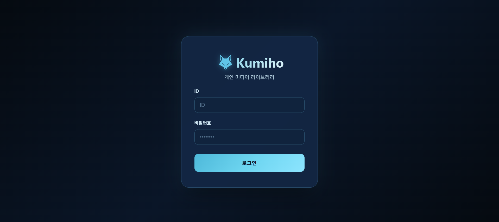
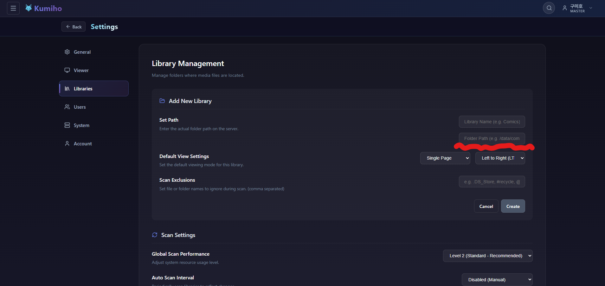

#  Kumiho

<div align="center">

[](https://discord.gg/KYaWSCUNQt)


**초경량, 고성능 개인 호스팅 웹 미디어 서버**</br>
**Ultra-lightweight**</br>
**High-performance**</br>
**Self-hosted Web Media Server**



</div>

---

## 🌐 Language(지원 언어)

- [English](#english)
- [日本語](#japanese)
- [한국어 (Korean)](#korean)

> **The primary language is Korean, and translations may not be perfect.**<br>Feedback is welcome and will be reflected as much as possible.
>
> **原文は韓国語であり、翻訳は完璧ではない可能性があります。**<br>ご意見をいただければ、可能な限り反映いたします。
>
> **베이스는 한국어이며 번역본은 완벽하지 않을 수 있습니다.**<br>의견 주시면 최대한 반영하도록 하겠습니다.

---

> [!IMPORTANT]
>
> **v0.9.0 Security Enhancement & Breaking Change**
> For improved security, the container execution privilege has been changed from `root` to a standard user (`appuser`).
>
> **Note for existing users**: If thumbnails are broken or you encounter "Permission Denied" errors, please ensure you set the `PUID` and `PGID` environment variables to match your account IDs (check with the `id` command in your terminal).
>
> **v0.10.x Docker update**: Docker base images were changed for CGO/native-library compatibility. Please re-pull the image and recreate the container when updating.
>
> **v0.11.1 Library Rescan**: Due to metadata structural changes, a full library rescan is required after updating to v0.11.1.

---

<a name="english"></a>

## 🇺🇸 What is Kumiho?

**Kumiho** is a self-hosted web media server designed to manage and stream your personal collection of comics and e-books.

It was originally developed by a developer for personal convenience, after feeling limitations with existing solutions. Written in **Golang**, Kumiho is lightweight and fast.

### ✨ Key Features

| Feature                      | Description                                                                                                                                   |
| :--------------------------- | :-------------------------------------------------------------------------------------------------------------------------------------------- |
| **🚀 Blazing Fast**          | Built with Golang, Kumiho runs as a native binary without JVM overhead, offering incredible scan speeds.                                      |
| **📂 File-System Mirroring** | It mirrors your physical folder structure directly. No complex metadata matching required—what you see in your OS is what you get in the app. |
| **⚡ Lightweight**           | Optimized for low-resource environments. It runs smoothly with minimal memory footprint.                                                      |
| **📱 Responsive Viewer**     | Provides a seamless streaming experience on PC, Tablet, and Mobile devices. Supports 'Webtoon' scrolling mode.                                |
| **🎧 Audiobook Support**     | Supports audiobook libraries with chapter list, resume playback, progress tracking, bookmarks, and sleep timer.                               |
| **🎵 Immersive BGM**         | Automatically plays audio files (`.mp3`) within the series folder when the filename matches.                                                  |

### Supported Formats

| Category     | Supported Extensions                                                                     |
| :----------- | :--------------------------------------------------------------------------------------- |
| **Images**   | `.jpg`, `.jpeg`, `.png`, `.webp`, `.gif`, `.bmp`                                         |
| **Archives** | `.zip`, `.cbz`                                                                           |
| **E-books**  | `.epub`, `.pdf`, `.txt`                                                                  |
| **Audio**    | `.mp3`, `.wav`, `.ogg`, `.oga`, `.flac`, `.m4a`, `.m4b`, `.aac`, `.wma`, `.opus`, `.mp4` |

> 📁 **Folder Structure**: Automatically recognizes image files in folders or archive files and organizes them into volumes/chapters.

#### 🔜 Coming Soon

| Category     | Planned Extensions            |
| :----------- | :---------------------------- |
| **Archives** | `.cbr`, `.rar`, `.cb7`, `.7z` |

- Support `comicInfo.xml`
  - Metadata management interaction
- OPDS Support
  - Mobile viewer application support

### 📁 Recommended Library Structure

#### 1) Series folder with volume/chapter files directly

```text
/books
└── My Series
    ├── 001.zip
    ├── 002.pdf
    └── 003.epub
```

#### 2) Series folder with chapter/volume subfolders

```text
/books
└── My Series
    ├── Chapter 01
    │   ├── 001.zip
    │   └── 002.zip
    ├── Chapter 02
    │   └── 001.pdf
    └── Chapter 03
        └── 001.epub
```

#### 3) Nested Folders (Infinite Hierarchy)

Kumiho supports **infinite folder hierarchy**. You can organize your series with any level of subfolders.

```text
/books
└── Grand Parent Category
    └── Parent Category
        └── My Series
            ├── Volume 01
            │   ├── Chapter 01
            │   │   └── 001.zip
            │   └── Chapter 02.pdf
            └── 002.epub
```

### 🎵 BGM Auto-Play Rule

- Supported audio formats: `.mp3`, `.ogg`, `.wav`, `.flac`, `.m4a`
- BGM auto-plays when the audio file has the same base filename as the currently opened volume/chapter file.
- Example: `001.zip` ↔ `001.mp3`, `001.epub` ↔ `001.mp3`

### 🎧 Audiobook Support

- Supported audiobook formats: `.mp3`, `.wav`, `.ogg`, `.oga`, `.flac`, `.m4a`, `.m4b`, `.aac`, `.wma`, `.opus`, `.mp4`
- Supports resume playback, chapter-based navigation, progress tracking, bookmarks, and sleep timer
- Audiobooks can be organized with the same nested folder structure used for books
- When creating a library for audiobooks, set the library type to **Audiobook**

### 🛠 Installation (Docker)

#### Docker Compose (Recommended)

```yaml
version: "3.8"
services:
  kumiho:
    image: ahahyeong/kumiho:latest
    container_name: kumiho
    restart: unless-stopped
    ports:
      - "9999:9999"
    volumes:
      - ./data:/app/data # Path to store database and data
      - ./config:/app/config # Path to store configuration
      - ./books:/books # Path to your library
    environment:
      - PUID=1000 # User ID (Can be found via `id` command)
      - PGID=1000 # Group ID
      - TZ=Asia/Seoul
      - JWT_SECRET=your_secret_key # Recommended for security
```

#### Docker Run

```bash
docker run -d \
  --name kumiho \
  -p 9999:9999 \
  -v $(pwd)/data:/app/data \
  -v $(pwd)/config:/app/config \
  -v $(pwd)/books:/books \
  -e PUID=1000 \
  -e PGID=1000 \
  -e TZ=Asia/Seoul \
  -e JWT_SECRET=your_secret_key \
  --restart unless-stopped \
  ahahyeong/kumiho:latest
```

### 📂 Library Path Setup Guide

If you mounted `./books:/books` in your Docker Compose `volumes` configuration, you must enter the **container internal path** `/books` on the Kumiho settings page.



1. Go to the **Settings > Libraries** tab.
2. Click the **Add New Library** button.
3. Enter `/books` in the **Set Path** field. (Do NOT use the host path `./books`!)

> Note: The scanner automatically excludes `@eaDir`, `#recycle`, `.DS_Store`, and `Thumbs.db`.

## 🐞 Bug Reports & Feature Requests

- [GitHub Issues](https://github.com/aha-hyeong/kumiho/issues)
- ahahyeong@gmail.com

---

> [!IMPORTANT]
>
> **v0.9.0 セキュリティ強化および重大な変更 (Breaking Change)**
> セキュリティ向上のため、コンテナの実行権限を `root` から一般ユーザー (`appuser`) に変更しました。
>
> **既存ユーザーの方へ**: サムネイルが表示されない、または "Permission Denied" エラーが発生する場合は、必ず `PUID` と `PGID` 環境変数を自身のユーザー ID（ターミナルで `id` コマンドで確認）に設定してください。
>
> **v0.10.x Docker更新**: CGO/ネイティブライブラリ互換性のため、Dockerベースイメージを変更しました. 更新時はイメージを再Pullし, コンテナを再作成してください.
>
> **v0.11.1 ライブラリの再スキャン**: メタデータの構造変更に伴い、v0.11.1へのアップデート後にライブラリの全体再スキャンが必要です。

---

<a name="japanese"></a>

## 🇯🇵 Kumiho(クミホ)とは？

**Kumiho**は、個人所有の漫画や小説などの書籍ファイルを管理し、ストリーミングできるWebベースのメディアサーバーです。

既存のソリューションに不便さを感じた開発者が、自身の利便性のために優先的に開発しました。**Golang**で書かれており、軽量で高速です。

### ✨ 主な特徴

| 特徴                                | 説明                                                                                                                         |
| :---------------------------------- | :--------------------------------------------------------------------------------------------------------------------------- |
| **🚀 圧倒的な速度**                 | Golangベースのネイティブバイナリで実行されます。JVMのオーバーヘッドがなく、スキャン速度が非常に高速です。                    |
| **📂 ファイルシステムミラーリング** | 複雑なメタデータ管理なしで、フォルダ構造そのままで（ツリービュー）ライブラリを表示します。                                   |
| **⚡ 軽量なリソース**               | 低スペックのNASでもメモリ使用量を気にせず快適に動作します。                                                                  |
| **📱 レスポンシブWebビューア**      | PC、タブレット、モバイルなど、どこでも途切れのないストリーミングビューアを提供します。（Webtoonモード対応）                  |
| **🎧 オーディオブック対応**         | オーディオブックライブラリをサポートし、チャプター一覧、続きから再生、進捗管理、ブックマーク、スリープタイマーを提供します。 |
| **🎵 没入型BGM再生**                | シリーズフォルダ内に作品ファイル名と同じオーディオファイル(`.mp3`)があれば、鑑賞時に自動再生されます。                       |

### 対応フォーマット

| 分類           | 対応拡張子                                                                               |
| :------------- | :--------------------------------------------------------------------------------------- |
| **画像**       | `.jpg`, `.jpeg`, `.png`, `.webp`, `.gif`, `.bmp`                                         |
| **アーカイブ** | `.zip`, `.cbz`                                                                           |
| **電子書籍**   | `.epub`, `.pdf`, `.txt`                                                                  |
| **オーディオ** | `.mp3`, `.wav`, `.ogg`, `.oga`, `.flac`, `.m4a`, `.m4b`, `.aac`, `.wma`, `.opus`, `.mp4` |

> 📁 **フォルダ構造**: フォルダ内の画像ファイル、またはアーカイブファイルを自動的に認識し、巻/チャプターとして構成します。

#### 🔜 対応予定

| 分類           | 予定拡張子                    |
| :------------- | :---------------------------- |
| **アーカイブ** | `.cbr`, `.rar`, `.cb7`, `.7z` |

- `comicInfo.xml` 対応
  - メタデータ管理の連携
- OPDS 対応
  - モバイルビューアアプリ対応

### 📁 推奨ライブラリ構成

#### 1) シリーズ直下に巻/チャプターファイルを配置

```text
/books
└── My Series
    ├── 001.zip
    ├── 002.pdf
    └── 003.epub
```

#### 2) シリーズ配下にチャプター(または巻)フォルダを 나눠서 배치

```text
/books
└── My Series
    ├── Chapter 01
    │   ├── 001.zip
    │   └── 002.zip
    ├── Chapter 02
    │   └── 001.pdf
    └── Chapter 03
        └── 001.epub
```

#### 3) 入れ子構造（無制限の階層）

Kumihoは**無制限のフォルダ階層**をサポートしています。サブフォルダを使用して、シリーズを自由に整理できます。

```text
/books
└── 大分類
    └── 中分類
        └── My Series
            ├── 第01巻
            │   ├── 第01話
            │   │   └── 001.zip
            │   └── 第02話.pdf
            └── 002.epub
```

### 🎵 BGM自動再生ルール

- 対応オーディオ形式: `.mp3`, `.ogg`, `.wav`, `.flac`, `.m4a`
- 閲覧中の巻/チャプターファイルと同じベース名のオーディオがある場合、自動再生されます。
- 例: `001.zip` ↔ `001.mp3`, `001.epub` ↔ `001.mp3`

### 🎧 オーディオブック対応

- 対応オーディオ形式: `.mp3`, `.wav`, `.ogg`, `.oga`, `.flac`, `.m4a`, `.m4b`, `.aac`, `.wma`, `.opus`, `.mp4`
- 続きから再生、チャプター移動、進捗管理、ブックマーク、スリープタイマーに対応
- 書籍と同じように、入れ子フォルダ構造でオーディオブックを整理できます
- オーディオブック用ライブラリを作成する場合は、ライブラリタイプを **Audiobook** に設定してください

### 🛠 インストール方法 (Docker)

#### Docker Compose (推奨)

```yaml
version: "3.8"
services:
  kumiho:
    image: ahahyeong/kumiho:latest
    container_name: kumiho
    restart: unless-stopped
    ports:
      - "9999:9999" # 外部ポート:内部ポート
    volumes:
      - ./data:/app/data # DBおよびデータ (必須)
      - ./config:/app/config # 設定 (任意)
      - ./books:/books # 図書ライブラリパス
    environment:
      - PUID=1000 # ユーザー ID (idコマンドで確認可能)
      - PGID=1000 # グループ ID
      - TZ=Asia/Seoul
      - JWT_SECRET=your_secret_key # セキュリティのための秘密鍵設定
```

#### Docker Run

```bash
docker run -d \
  --name kumiho \
  -p 9999:9999 \
  -v $(pwd)/data:/app/data \
  -v $(pwd)/config:/app/config \
  -v $(pwd)/books:/books \
  -e PUID=1000 \
  -e PGID=1000 \
  -e TZ=Asia/Seoul \
  -e JWT_SECRET=your_secret_key \
  --restart unless-stopped \
  ahahyeong/kumiho:latest
```

### 📂 ライブラリパス設定ガイド

Docker Compose設定で`volumes`に`./books:/books`としてマウントした場合、Kumiho設定ページでは**コンテナ内部パス**である`/books`を入力する必要があります。


1. **Settings > Libraries** タブに移動します。
2. **Add New Library** ボタンをクリックします。
3. **Set Path** フィールドに `/books` を入力します。（ホストパスである `./books` ではありません！）

> 注: スキャナーは `@eaDir`, `#recycle`, `.DS_Store`, `Thumbs.db` を自動的に除外します。

## 🐞 バグ報告・機能リクエスト

- [GitHub Issues](https://github.com/aha-hyeong/kumiho/issues)
- ahahyeong@gmail.com

---

> [!IMPORTANT]
>
> **v0.9.0 보안 강화 및 중대 변경 사항 (Breaking Change)**
> 이번 업데이트는 보안 향상을 위해 컨테이너 실행 권한을 `root`에서 일반 사용자(`appuser`)로 변경하였습니다.
>
> **기존 사용자 유의사항**: 썸네일이 깨지거나 "Permission Denied" 에러가 발생하는 경우, 반드시 `PUID`와 `PGID` 환경변수를 자신의 계정 ID(터미널에서 `id` 명령어로 확인)로 설정해 주시기 바랍니다.
>
> **v0.10.x Docker 업데이트**: CGO/네이티브 라이브러리 호환성을 위해 Docker 베이스 이미지를 변경했습니다. 업데이트 시 이미지를 다시 pull하고 컨테이너를 recreate 해주세요.
>
> **v0.11.1 라이브러리 전체 재스캔**: 메타데이터 구조 변경으로 인해 v0.11.1 업데이트 후 라이브러리 전체 재스캔이 필요합니다.

---

<a name="korean"></a>

## 🇰🇷 구미호(Kumiho) 소개

<strong>구미호(Kumiho)</strong>는 만화, 소설 등 개인 소장 도서 파일을 관리하고 스트리밍할 수 있는 웹 기반 미디어 서버입니다.

기존 솔루션들에서 불편함을 느낀 개발자가 본인의 편의를 위해 우선적으로 개발했습니다. **Golang**으로 작성되어 가볍고 빠릅니다.

### ✨ 주요 특징

| 특징                      | 설명                                                                                               |
| :------------------------ | :------------------------------------------------------------------------------------------------- |
| **🚀 압도적인 속도**      | Golang 기반의 네이티브 바이너리로 실행됩니다. JVM 오버헤드가 없으며 스캔 속도가 매우 빠릅니다.     |
| **📂 파일 시스템 미러링** | 복잡한 메타데이터 관리 없이도, 내 폴더 구조 그대로(Tree View) 라이브러리를 보여줍니다.             |
| **⚡ 가벼운 리소스**      | 저사양 NAS에서도 메모리 점유율 걱정 없이 쾌적하게 구동됩니다.                                      |
| **📱 반응형 웹 뷰어**     | PC, 태블릿, 모바일 어디서든 끊김 없는 스트리밍 뷰어를 제공합니다. (Webtoon 모드 지원)              |
| **🎧 오디오북 지원**      | 오디오북 라이브러리를 지원하며 챕터 목록, 이어듣기, 진행도 추적, 북마크, 수면 타이머를 제공합니다. |
| **🎵 몰입형 BGM 재생**    | 시리즈 폴더 내에 작품 파일명과 동일한 오디오 파일(`.mp3`)이 있으면 감상 시 자동 재생됩니다.        |

### 지원 포맷

| 분류         | 지원 확장자                                                                              |
| :----------- | :--------------------------------------------------------------------------------------- |
| **이미지**   | `.jpg`, `.jpeg`, `.png`, `.webp`, `.gif`, `.bmp`                                         |
| **아카이브** | `.zip`, `.cbz`                                                                           |
| **전자책**   | `.epub`, `.pdf`, `.txt`                                                                  |
| **오디오**   | `.mp3`, `.wav`, `.ogg`, `.oga`, `.flac`, `.m4a`, `.m4b`, `.aac`, `.wma`, `.opus`, `.mp4` |

> 📁 **폴더 구조**: 폴더 내 이미지 파일들, 또는 아카이브 파일을 자동으로 인식하여 볼륨/챕터로 구성합니다.

#### 🔜 지원 예정

| 분류         | 예정 확장자                   |
| :----------- | :---------------------------- |
| **아카이브** | `.cbr`, `.rar`, `.cb7`, `.7z` |

- `comicInfo.xml` 지원
  - 메타데이터 관리 지원
- `OPDS` 기능
  - 모바일 뷰어 앱 지원

### 📁 추천 라이브러리 구조

#### 1) 시리즈 폴더에 볼륨/챕터 파일 직접 배치

```text
/books
└── My Series
    ├── 001.zip
    ├── 002.pdf
    └── 003.epub
```

#### 2) 시리즈 폴더 하위에 챕터(또는 볼륨) 폴더를 나누어 배치

```text
/books
└── My Series
    ├── Chapter 01
    │   ├── 001.zip
    │   └── 002.zip
    ├── Chapter 02
    │   └── 001.pdf
    └── Chapter 03
        └── 001.epub
```

#### 3) 중첩 폴더 구조 (무제한 계층)

구미호는 **무제한 폴더 계층 구조**를 지원합니다. 하위 폴더를 활용하여 시리즈를 자유롭게 구성할 수 있습니다.

```text
/books
└── 대분류 폴더
    └── 중분류 폴더
        └── My Series
            ├── 01권 폴더
            │   ├── 01화 폴더
            │   │   └── 01.zip
            │   └── 02화.pdf
            └── 02권.epub
```

### 🎵 BGM 자동 재생 규칙

- 지원 오디오 형식: `.mp3`, `.ogg`, `.wav`, `.flac`, `.m4a`
- 현재 읽는 볼륨/챕터 파일과 베이스 파일명이 동일한 오디오 파일이 있으면 자동 재생됩니다.
- 예시: `001.zip` ↔ `001.mp3`, `001.epub` ↔ `001.mp3`

### 🎧 오디오북 지원

- 지원 오디오 형식: `.mp3`, `.wav`, `.ogg`, `.oga`, `.flac`, `.m4a`, `.m4b`, `.aac`, `.wma`, `.opus`, `.mp4`
- 이어듣기, 챕터 이동, 진행도 추적, 북마크, 수면 타이머를 지원합니다
- 책과 동일하게 중첩 폴더 구조로 오디오북을 정리할 수 있습니다
- 오디오북용 라이브러리를 생성할 때는 라이브러리 타입을 **Audiobook**으로 설정해야 합니다

### 🛠 설치 방법 (Docker)

#### Docker Compose (권장)

```yaml
version: "3.8"
services:
  kumiho:
    image: ahahyeong/kumiho:latest
    container_name: kumiho
    restart: unless-stopped
    ports:
      - "9999:9999" # 외부포트:내부포트
    volumes:
      - ./data:/app/data # DB 및 데이터 (필수)
      - ./config:/app/config # 설정 (선택)
      - ./books:/books # 도서 라이브러리 경로
    environment:
      - PUID=1000 # 유저 ID (id 명령어로 확인 가능)
      - PGID=1000 # 그룹 ID
      - TZ=Asia/Seoul
      - JWT_SECRET=your_secret_key # 보안을 위한 비밀키 설정
```

#### Docker Run

```bash
docker run -d \
  --name kumiho \
  -p 9999:9999 \
  -v $(pwd)/data:/app/data \
  -v $(pwd)/config:/app/config \
  -v $(pwd)/books:/books \
  -e PUID=1000 \
  -e PGID=1000 \
  -e TZ=Asia/Seoul \
  -e JWT_SECRET=your_secret_key \
  --restart unless-stopped \
  ahahyeong/kumiho:latest
```

### 📂 라이브러리 경로 설정 가이드

Docker Compose 설정에서 `volumes`에 `./books:/books`로 마운트한 경우, Kumiho 설정 페이지에서는 **컨테이너 내부 경로**인 `/books`를 입력해야 합니다.


1. **설정 > 라이브러리** 탭으로 이동합니다.
2. **Add New Library** 버튼을 클릭합니다.
3. **Set Path** 필드에 `/books`를 입력합니다. (호스트 경로인 `./books`가 아닙니다!)

> 참고: 스캐너는 `@eaDir`, `#recycle`, `.DS_Store`, `Thumbs.db`를 자동으로 제외합니다.

## 🐞 버그 제보 및 기능 요청

- [GitHub Issues](https://github.com/aha-hyeong/kumiho/issues)
- ahahyeong@gmail.com

---
